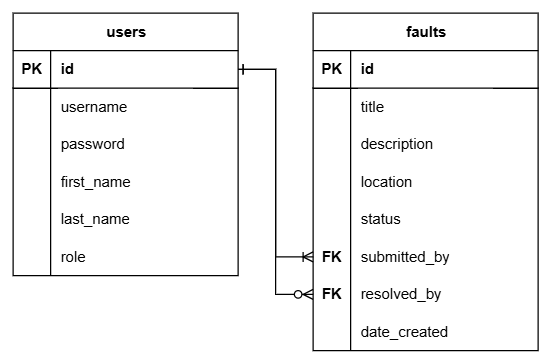

# Fault Reporter

Fault Reporter is a lightweight web application built with Flask that allows users to submit and manage building maintenance issues. The system supports role-based actions for standard users and administrators and demonstrates core principles of Agile software development.

## Features

- User login and session tracking using Flask-Login
- Submission of building faults with title, description, location, and status
- Admin interface to update or resolve reported faults
- User and fault data stored in a relational SQLite database
- Clear separation of concerns using Flask's routing and template systems

## Technologies

- Python 3.10
- Flask
- Flask-Login
- SQLite (with SQLAlchemy ORM)
- HTML, CSS (Jinja2 templating)

## Getting Started

These steps assume you have Python 3.10+ installed.

### 1. Clone the repository

```bash
git clone https://github.com/YOUR-USERNAME/fault-reporter.git
cd fault-reporter
```

### 2. Create and activate a virtual environment (Windows)

```bash
python -m venv venv
venv\Scripts\activate
```

> On macOS/Linux, use:  
> `source venv/bin/activate`

### 3. Install dependencies

```bash
pip install -r requirements.txt
```

### 4. Create the database

If `app.db` is not provided or you want to rebuild it, run:

```bash
sqlite3 app.db < schema.sql
```

### 5. Run the application

```bash
flask run
```

Visit [http://127.0.0.1:5000](http://127.0.0.1:5000) in your browser.

## Project Structure

- `app.py`: Main application logic
- `templates/`: Jinja2 HTML templates
- `static/`: CSS and static files
- `schema.sql`: SQL commands to create tables
- `screenshots/`: Annotated screenshots for demonstration
- `diagrams/FaultReporterERD.png`: Entity Relationship Diagram

## ERD

The Entity Relationship Diagram is located at `/diagrams/FaultReporterERD.png`.

It shows the structure and relationships between the two main tables:

- `users`: stores user credentials and roles
- `faults`: stores fault reports, including references to who submitted and optionally who resolved them

The diagram reflects:
- A mandatory many-to-one relationship between `faults.submitted_by` and `users.id`
- An optional many-to-one relationship between `faults.resolved_by` and `users.id`



## Notes

This application was created for a Level 5 Software Engineering and Agile module. It demonstrates an understanding of web development, database modelling, version control, and Agile delivery practices.
