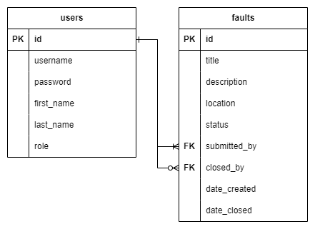

# Fault Reporter

Fault Reporter is a lightweight web application built with Flask that allows users to submit and manage building maintenance issues. The system supports role-based actions for standard users and administrators and demonstrates core principles of Agile software development.

## Features

- User login and session tracking using Flask-Login
- Submission of building faults with title, description, location, and status
- Admin-only functionality to delete faults and create new users
- Support for marking faults as closed (with automatic close date)
- Fault and user data stored in a relational SQLite database
- All forms (Add Fault, Add User) presented in responsive Bootstrap modals
- UK-style date formatting using Jinja filters
- Clean, Bootstrap-based interface for usability and visual clarity

## Technologies

- Python 3.10
- Flask
- Flask-Login
- SQLite (accessed via `sqlite3`)
- HTML, CSS (Jinja2 templating + Bootstrap 5)

## Getting Started

These steps assume you have Python 3.10+ installed.

### 1. Clone the repository

```bash
git clone https://github.com/YOUR-USERNAME/fault-reporter.git
cd fault-reporter
```

### 2. Create and activate a virtual environment (Windows)

```bash
python -m venv venv
venv\Scripts\activate
```

> On macOS/Linux, use:  
> `source venv/bin/activate`

### 3. Install dependencies

```bash
pip install -r requirements.txt
```

### 4. Create the database

If `app.db` is not provided or you want to rebuild it, run:

```bash
sqlite3 app.db < schema.sql
```

### 5. Run the application

```bash
flask run
```

Visit [http://127.0.0.1:5000](http://127.0.0.1:5000) in your browser.

## Project Structure

- `app.py`: Main application logic
- `templates/`: Jinja2 HTML templates
- `static/`: CSS and static files
- `schema.sql`: SQL commands to create tables
- `screenshots/`: Annotated screenshots for demonstration
- `diagrams/FaultReporterERD.png`: Entity Relationship Diagram

## ERD

The Entity Relationship Diagram is located at `/diagrams/FaultReporterERD.png`.

It shows the structure and relationships between the two main tables:

- `users`: stores user credentials, names, and roles
- `faults`: stores fault reports, including submitter, optional closer, and closure date

The diagram reflects:
- A mandatory many-to-one relationship between `faults.submitted_by` and `users.id`
- An optional many-to-one relationship between `faults.closed_by` and `users.id`
- Timestamps for `date_created` and `date_closed`



## Screenshots

Key screenshots are located in the `/screenshots/` folder, including:

- **Login form** – `01_login.png`
- **Fault list for regular user showing open and closed faults** – `02_home_user.png`
- **Modal for submitting a fault** – `03_submit_modal.png`
- **Admin view showing delete buttons and “Add New User” button** – `04_admin_buttons.png`
- **Modal for adding a user** – `05_add_user_modal.png`

## Testing

Basic route-level tests are included in `tests/test_routes.py`, using `pytest`.

To run the tests:

```bash
pip install -r requirements.txt
pytest
```

These tests verify that key routes behave correctly (e.g. homepage redirects unauthenticated users, login page loads as expected).

## Deployment

This application is deployed online via [Render](https://render.com) using the free tier:

**Live App**: [https://fault-reporter.onrender.com](https://fault-reporter.onrender.com)

**Note**:  
Render’s free plan automatically suspends the application after 15 minutes of inactivity.  
The first request may take 30–60 seconds to load while the service "wakes up."  
Please be patient, the app will load shortly.

## Notes

This application was created for a Level 5 Software Engineering and Agile module. It demonstrates:

- CRUD operations across users and faults
- Flask routing and database integration
- Secure authentication and role-based access
- Use of version control (Git/GitHub)
- Bootstrap 5 for responsive design
- Jinja templating and date formatting